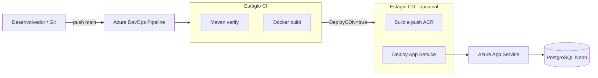

# Sprint 2 — Desenho do pipeline CI/CD (DevOps + Cloud)

Este documento atende ao item de **desenho do pipeline** com **explicação (dissertação) por etapa**. Você pode copiar trechos para o PDF da entrega.

---

## 1. Visão geral (desenho lógico)

**Fluxo de informação:** o código versionado no Git dispara o pipeline no Azure DevOps. O **CI** garante que o projeto compila, passa nos testes e que a imagem Docker é construíível. O **CD** (quando habilitado) publica a imagem no **Azure Container Registry** e atualiza o **App Service** para rodar o novo container. A aplicação em produção usa JDBC para o **Neon** (banco na nuvem), com senha via variável de ambiente `NEON_PASSWORD` configurada no App Service.

---

## 2. Estágio CI — Integração contínua

### 2.1 Gatilho (trigger)

**O que é:** o pipeline é disparado automaticamente quando há `push` na branch `main` (integração com o fluxo de trabalho do grupo).

**Para que serve:** qualquer alteração enviada ao repositório passa pelas mesmas verificações, reduzindo regressões e padronizando qualidade.

### 2.2 Agent pool (`ubuntu-latest`)

**O que é:** máquina virtual efêmera da Microsoft onde os comandos rodam (Linux Ubuntu).

**Para que serve:** ambiente reprodutível; o professor (ou qualquer pessoa com acesso ao projeto no Azure DevOps) obtém o mesmo resultado ao reexecutar o pipeline.

### 2.3 Checkout do código (`checkout: self`)

**O que é:** baixa o commit que disparou o build para o disco do agent.

**Para que serve:** garante que Maven e Docker usam exatamente o código daquele commit.

### 2.4 JDK 17 (`UseJavaVersion@0`)

**O que é:** instala/seleciona o Java 17 no agent.

**Para que serve:** alinhar com o `pom.xml` do projeto (`java.version` 17) e evitar falhas por versão incorreta.

### 2.5 Maven verify (`mvnw -B verify`)

**O que é:** executa o Maven Wrapper na pasta `odontoprev`: compila, roda testes (perfil `test` com H2 em memória) e empacota.

**Para que serve:** **integração contínua** no sentido clássico: o build precisa estar verde para o artefato ser considerado “pronto” para as etapas seguintes.

### 2.6 Docker build (`Docker@2` command build)

**O que é:** constrói a imagem a partir do `Dockerfile` do projeto, sem publicar em registro.

**Para que serve:** valida empacotamento da aplicação como container (coerente com deploy em App Service for Containers) antes de qualquer publicação.

---

## 3. Estágio CD — Entrega contínua (opcional até configurar Azure)

### 3.1 Condição `DeployCDN = true`

**O que é:** o estágio CD **só roda** se a variável de pipeline `DeployCDN` estiver definida como `true` no Azure DevOps.

**Para que serve:** permitir que o grupo configure primeiro **service connections** (Azure + ACR) e nomes dos recursos sem quebrar o CI na primeira entrega; quando tudo estiver pronto, ativa-se o CD para automatizar publicação.

### 3.2 Build and push (`Docker@2` buildAndPush)

**O que é:** gera a imagem e envia para o **Azure Container Registry** usando a service connection de registry.

**Para que serve:** **entrega contínua** do artefato de execução (imagem versionada por `Build.BuildId` e `latest`) para consumo pelo App Service.

### 3.3 Deploy no App Service (`AzureWebAppContainer@1`)

**O que é:** atualiza o Web App Linux para puxar o container `$(acrLoginServer)/odontoprev:$(Build.BuildId)`.

**Para que serve:** coloca a nova versão no ar de forma repetível, com rastreabilidade (número de build).

### 3.4 Dados no banco (Neon)

**O que é:** a aplicação, ao subir no Azure, lê `NEON_PASSWORD` das **Application settings** do App Service (não fica no Git).

**Para que serve:** persistência na **nuvem** (requisito da disciplina): CRUD na aplicação reflete no PostgreSQL hospedado (Neon).

---

## 4. Relação com custo e qualidade (texto para entrega)

Automatizar **CI** reduz custo operacional de retrabalho manual (menos “funciona na minha máquina”). Automatizar **CD** reduz tempo entre correção e produção e diminui erro humano no deploy. O pipeline típico (build → teste → imagem → deploy) está alinhado ao que a disciplina descreve como fluxo DevOps contínuo.

---

## 5. Onde está o YAML

Arquivo na raiz do repositório: **`azure-pipelines.yml`**.

Instruções rápidas para rodar no Azure DevOps: seção **Sprint 2 — Azure DevOps** no `Readme.md`.
